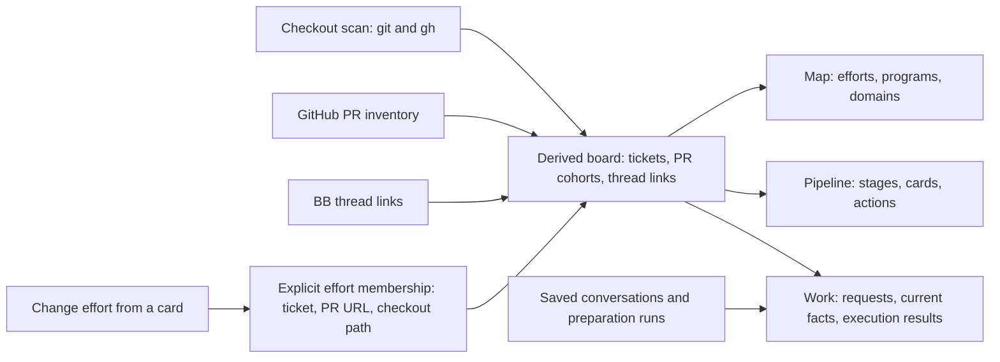
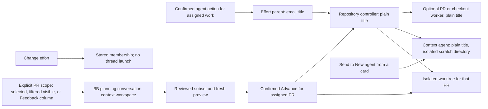

# Workstreams

Workstreams connects git checkouts that belong to the same ticket, even across
repositories. Its Map groups tickets into efforts, programs, and domains when
the evidence supports those levels. Its Work view follows saved planning
conversations and preparation runs. Its Pipeline places pull requests and
checkout work in six stages. The legacy Board groups checkouts by next action
or effort.

## Get started

From this directory:

```sh
npm install
bb plugin install .
bb plugin config workstreams
```

Set `scanRoots` to the directories that hold your checkouts. If you leave it
empty, Workstreams scans the paths of your BB projects. Open **Workstreams** in
the sidebar, or run `bb workstreams refresh` followed by `bb workstreams list`.

An authenticated `gh` supplies pull request state and enables Board actions.
Without it, the board shows observed local git activity, marks other checkouts
as unverified, and shows a warning. Workstreams looks
for ticket keys in branch names, Linear linkback comments, pull request titles
and descriptions, and checkout directory names, in that order. A ticket's
checkouts form one cluster. Related clusters can form an effort; levels that do
not add information collapse.

## Choose enrichment

The board works without model keys. Optional keys add detail:

| Setting | What it adds |
| --- | --- |
| `linearApiKeys` | Ticket titles, state, project, parent, and team names from each matching Linear workspace. The older `linearApiKey` setting still works. |
| `typesafeApiKey` | Jev selects ticket summaries and assigns related tickets to efforts and higher groups. |
| `anthropicApiKey` | With Jev enabled, Claude Sonnet 5 names groups and flags groups whose members look unrelated. It does not change membership. |

Set these under **Plugins → Workstreams** or with `bb plugin config workstreams
set <key> <value>`. Keys are optional. An Anthropic key alone does not enable
grouping.

The scanner stores board facts and caches in BB's local plugin storage. It uses
`git` locally and your authenticated `gh` to read GitHub pull requests and
perform Board actions that you confirm. A Linear key sends ticket identifiers
to Linear and retrieves issue details. With model keys, Jev receives ticket
keys, repository names, pull request titles, and available Linear context to
select summaries and groups. Bounded Jev reviews can revisit uncertain
singletons and mixed groups using shared outcome evidence; saved effort
membership stays fixed. Anthropic receives the member keys, summaries,
repository names, candidate phrases, and available Linear or thread-title
context needed to name a group. Automatic grouping calls happen when semantic
inputs change; an unchanged rescan reuses cached decisions. The optional **Fetch Linear details
via agent** action starts a BB thread only when you confirm it.

Workstreams starts planning and context threads with the **Planning model** setting (`planningModel`, default `codex/gpt-6-sol/medium`) and work, repair, and effort repository controller threads with the **Code-work model** setting (`codeModel`, default `codex/gpt-6-sol/high`). Each value is `providerId/model/reasoningLevel`. Existing threads from another provider remain available as history; choose **New agent** to continue through Workstreams on the configured provider.

## Organize work from a thread

The effort chip above the thread composer shows the thread's effort: its
color dot, its name, and how many of its PRs need you. Select the chip to open
that effort's card on the deck. A thread without an effort of its own shows the
card the deck puts it on: the effort its linked PRs are in, else the service
card of the repository most of its PRs are in, such as `folio · service`, with
its count. Every open PR no effort owns is on its repository's service card. A
thread with no effort and no one repository shows **No effort**; the deck lists
it under **Loose threads**. The chip counts the PRs the thread records and the
PR in a checkout only it runs in. A PR that the thread reaches only by branch
name, a path it worked in, or a checkout other threads share doesn't count.

Select **⌄** beside the chip to change the effort. Type to filter the list, or
use the up and down arrow keys, then press Enter to pick. Esc closes the
popover. Suggested efforts come first, each with the strongest signal behind
it: the effort has a PR that the thread links, the thread title names one of
its tickets, the classifier suggests it for a linked PR, or it's the parent
thread's effort. With a TypeSafe key, **Ask Jev to suggest** asks Jev to
compare the thread with your efforts; it runs only when you select it. **+ New
effort** creates an effort from the name you typed. **Remove from effort** is
at the bottom. A pick applies at once, and **Undo** appears beside the chip for
8 seconds. Undo puts back the thread's effort and lets go the work that the
change brought in. It refuses, changing nothing, once that work moved again,
or when it would put work back into a done effort or change an effort under
automatic dispatch.

After you assign a thread, its confirmed, unassigned work inherits the effort,
including existing recorded work and work discovered later. Workstreams
discovers PRs through the thread's exact checkout, recorded actions, or
explicit PR links. A PR mentioned only in a title or discussion doesn't inherit
automatically. Existing explicit assignments stay intact, and removing the
thread from its effort leaves assigned work where it is.

The popover lists the thread's linked PRs as chips. A PR in another effort
names that effort and offers **Move here**, which moves it into the thread's
effort with its ticket; a ticket move includes its related PRs and checkouts.
When a move takes more than that PR and its tickets, **Move here…** first lists
what else moves and waits for **Move all**.
**+ Link PR** lists tracked pull requests to link to the thread. Both take an
Undo. A done effort takes no new work: reopen it first.

Explicit assignments use the same ticket and PR membership as the board.
Assigning work preserves existing thread parents and worker history and does
not create a coordinator or start an agent. You can set up a coordinator
separately. Turn off automatic dispatch for an affected effort before moving
its work. Automatic inheritance pauses while the destination effort has
automatic dispatch enabled.

## How work and agents connect

Workstreams combines scanned checkouts, GitHub pull request inventory, and
thread links into work context. Explicit effort membership for a ticket, pull
request, or checkout path takes precedence over inferred grouping. Map,
Pipeline, and Work read the resulting board without starting threads.



Changing a card's effort transfers the affected tickets, PRs, and checkout
paths after you review the scope. The change updates membership;
it does not launch an agent. When a checkout gains a PR, its explicit path
membership supplies the effort unless an explicit ticket or PR owner takes
precedence.



The confirmed agent action creates a missing parent or controller when it needs
one. Newly created coordinators and controllers use isolated directories that
do not contain a repository checkout; existing thread environments stay intact.
A controller can work directly or delegate a bounded
task to a child. Sending a card message can create a context agent under the
controller; if the parent is unavailable, Workstreams starts a linked context
agent without changing the stored parent association. Context agents inspect
the referenced work and use guarded checkout or PR actions in execution
workspaces for requested repairs. They do
not reserve a PR checkout by starting a conversation.
Work without an effort uses one shared **Unassigned work** parent and a plain
repository child. This placement organizes threads without assigning the PR or
checkout to an effort. A personal workspace keeps the same hierarchy when no
matching BB project is available.
Advance keeps each PR's isolated worktree for inspection after the result
finishes. Workstreams retains merged PR worktrees; automatic cleanup is not
implemented.

## Use the views

Every view shares one header. Its tabs are **Efforts** and **All PRs**, and
**More** opens **Map**, **Pipeline**, **Work**, **Board**, **Efforts admin**,
and **How it works**. On its right, the header shows when the view last read
its data, **Mark seen** on a view that has it, **⌘K**, and **?**. In Efforts
and All PRs, ⌘K lists every action and ? lists the keys. On other views, ⌘K
goes to a view, and ? opens How this works, or a roster's keys on a roster.

- **Efforts:** Workstreams first opens here, then on the last view you chose.
  **Overview** comes first, before the effort cards, and takes no number key.
  Its action matrix shows what needs you and what's blocked in each effort,
  **Aging blockers** lists the oldest waits on others, and each effort's tile
  names its next step. Select any of them to open that effort's card. Flip
  cards with [ and ], or press 1–9 for an effort. A card lists its open PRs by
  the move each needs. Every GitHub write lists each PR in a confirm, then
  waits with Undo, and a merge runs only from the fresh merge preview.
- **All PRs:** Every open PR you author and every open PR an effort names, in
  three lists. **Your turn** comes first: your PRs where a real follow-up waits
  on you, by effort, with **No effort** last: an approval's note you haven't
  replied to, or changes a person requested that no push or reply of yours
  followed. Only these count on the badge. **Comments only**
  follows, closed until you open it: PRs where only a person's comments,
  open threads where another person had the last word (bots aside), or bot notes from review apps
  such as Claude, Codex, or Copilot, wait. A thread you replied to last is
  the reviewer's turn. Select rows in either (x, a click, Shift for a range, or ⇧X for all of
  Your turn) and **Address selected** (b) starts one batch thread for them at
  once, with no listing: it waits 8 s for Undo, then starts on the code-work
  model, under the effort's parent when every PR shares one. Its prompt opens
  with a link to each PR, as its first reply and its report do. It holds each
  PR until it finishes, addresses every comment, bot notes included, replies to
  each reviewer's note, and never merges. Each PR it sent stays on Your turn with one
  state chip that opens the thread: Sending, Working, Needs you, Done, Blocked,
  Ended without a report, or Not sent, until GitHub shows its feedback cleared.
  A PR it left out says why on its row. The deck's selection offers the same.
  On a PR that has a thread, f lists what that thread gets for you to confirm.
  **Other open PRs** follows, by effort; each row shows the PR's state
  and next step. A change request you answered with a push or a reply waits
  here with **Re-request @login**, and approval notes you answered wait here
  on your Confirm; both still hold the merge, and Address leaves them out.
  **Nudge** appears only where a reviewer has waited long
  enough, and the server checks again before it sends. A Your turn row offers
  none for a reviewer who hasn't answered yet. All PRs never confirms
  review notes or merges; those run from the effort's card. Each effort's name
  opens its roster.
- **Efforts admin:** Administer explicitly saved efforts from one list.
  Create an effort without starting a thread, edit its name and goal, archive
  it, or restore it. Archived efforts retain their work and history. **Merge into…**
  previews combined membership and thread routing before applying the change.
  The destination keeps its identity, and old effort IDs resolve to it.
  Thread conversations remain separate. Resolve any preview blockers before
  merging; pending thread updates remain visible for retry. Archiving waits
  for queued or active preparation to settle and requires automatic dispatch
  to be off. Renaming also updates an idle coordinator's title; if that update
  fails, save again to retry.
- **Work:** Follow saved planning conversations and preparation runs in a
  vertical list. Expand a request to inspect its exact PR scope, current
  facts, and execution history. Working, waiting, results to inspect, and
  merge candidates remain distinct. A completed thread does not establish
  merge readiness. Plan selected work through the existing conversation
  flow, or review a preparation preview before starting workers. Opening
  Work does not start agents. This view uses the existing scheduler; it does
  not automatically authorize another preparation attempt after a result
  needs inspection. Pipeline and Map remain available alongside it.
- **Pipeline:** Track each open pull request once across **Build**, **Review**,
  **Feedback**, **Ready**, **Merged**, and **Released**. A draft stays in Build,
  even when its checks fail. Switch between stage columns and effort swimlanes;
  inventory-only PRs join their saved effort or ticket cohort, and unmatched
  PRs appear in **One-offs**. Cards show one blocker, agent activity, and a
  primary action. Open prerequisite PRs appear above their dependents in each
  stage. Dependents in the same stage nest beneath their parent; links on the
  parent show each dependent's stage. Unrelated PRs remain newest first,
  with checkout-only work ordered by its latest commit. Held cards stay below
  unheld cards. Merged and released cards use their merge date. Use **Open
  details** for merge gates, stack order,
  linked threads, checkout actions, and holds. Select a card by its title;
  the details button opens its drawer separately. Select the effort label or
  **Change effort…** in the card menu to review and move its work. Held PRs
  stay in their stage, show **On hold**,
  and offer **Release**; bulk actions and agent counts exclude them. Pipeline
  shows the five most recent merged cards and three most recent release-tagged
  cards until you choose **Show all**. Closed PRs that did not merge remain
  omitted by the current scan. A brief arrival cue marks changes to a card's
  stage, blocker, activity, or hold state. Unchanged refreshes stay still, and
  reduced-motion preferences disable the cue.
- **Pipeline actions:** Use a card to merge, advance, fix, nudge, or open a
  parent PR. Each card's **Next** line names its next move. Use card checkboxes
  or **Select visible**, then **Advance selected** to preview PRs across stages;
  search keeps earlier selections. **Advance** accepts open, unheld PRs,
  including drafts and PRs awaiting approval. The preview separates feedback,
  branch, and failed-check work from readiness checks, waiting PRs, and skips.
  **Review → Nudge** selects
  reviewers on PRs open for at least seven days. **Ready → Merge** processes
  unblocked PRs in order, with confirmation for each direct action. The agent
  sheet shows the plan, workspace, and whether work can push. Advance batch
  instructions combine the service rules with direction saved in the preview;
  single-row agent prompts and repair direction are editable. Progress appears on each card. Use
  **Advance history** in the Pipeline options menu for saved batch details.
- **Work on these…:** Open a scoped conversation for the exact selected,
  filtered visible, or Feedback column open PRs, including held PRs. The panel
  reads an existing conversation before it offers a first instruction. Sending
  that instruction starts one visible BB
  thread in a context workspace. The thread can inspect cached PR facts and
  propose an ordered subset with a reason for each excluded PR. A held PR stays
  in the original scope but cannot enter the preparation subset until its hold
  is released. Review a fresh Advance preview, then choose **Start preparation**
  to admit the proposed subset to the existing scheduler. The conversation
  retains its scope, proposal, batch links, and per-PR results across reloads.
  Follow-up messages use the same BB thread. A later proposal affects a later
  preparation batch; it does not cancel work that already started. If thread
  creation is unconfirmed, **Check for existing thread** searches for the saved
  conversation ID without starting another thread.
- **Message agents:** On a PR or checkout card, choose **Message agent** to
  send a question or instruction without leaving Pipeline. Select a linked
  thread or **New agent**. When you send to a new agent, Workstreams starts a
  conversation with the card's PR or Linear reference and a cached work
  snapshot. A status question authorizes inspection and reporting; a repair
  request still follows the checkout or PR hold and ownership rules. Held and
  closed PRs support diagnosis, not execution. **Rebase and PTAL** fills an
  editable draft; only **Send message** delivers it. The composer reports
  whether BB sent or queued the message, shows the latest reply and live
  status, and offers **Open thread** and **Follow up**. Repository and effort
  threads can include work on other PRs.
- **Map:** Explore the grouping hierarchy. Switch between theme and risk faces,
  filter by status and code surface, and open a linked agent thread.
- **Approved filter:** Keep approved open PRs in view across Map, Pipeline,
  and the legacy Board; the selection persists across views and reloads. Map dims
  nonmatching work without changing its layout and counts checkout-backed PRs;
  Board also includes the PR inventory.
- **Legacy Board:** Open **Board** from **More**. **Efforts**
  groups all tracked checkouts by effort. Open PRs
  without a scanned checkout join an effort when a saved PR link or an
  unambiguous ticket match connects them. Other PRs appear under **No effort
  assigned**. **PR backlog**
  groups your open PRs by next action in organizations represented by scanned
  projects, including PRs without a checkout. Approved
  is a review decision; **Ready to merge** also requires clear checks, review
  threads, branch state, stack dependencies, and no feedback to address: a
  reviewer's comment or an approval's note that neither your reply on the PR
  nor your confirmation answers. A PR that mentions it is no answer. Direct
  merge, branch update, and reviewer nudge actions ask for confirmation. CI,
  conflict, and review work shows the planned steps before you start a
  dedicated agent thread. You can expand and edit its instructions.
  Agent repairs inspect the PR and base, address actionable feedback, test,
  commit and push code changes, reply on the PR, and recheck live merge gates.
  A remote PR needs a scanned checkout for a single-PR agent repair; direct GitHub
  actions remain available without one. Merged and release-tagged work stays
  under its effort in collapsed sections.
  After the author pushes a newer head, resolves review threads, and posts a
  directed PTAL, the row reads **Awaiting re-review** while GitHub still reports
  changes requested. Workstreams does not send another PTAL or reviewer nudge.
- **Bulk advance:** In **Pipeline**, select open, unheld cards across stages and
  choose **Advance selected**. The legacy **PR backlog** offers the same action.
  Review the exact selection, planned feedback, branch, and failed-check work,
  and any waiting or skipped PRs before starting. For a
  PR in an effort, Workstreams routes each instruction through one persistent
  repository controller under the effort coordinator. The controller handles
  PRs in sequence and can delegate bounded PR work to child threads. Each PR
  keeps its own result and isolated worktree. If the effort has no coordinator,
  the confirmed action creates one
  before creating its repository controller. An unassigned PR worker starts
  beneath its shared repository parent. The agent
  reads reviews and current code, verifies fixes already made, addresses
  remaining feedback, and integrates the base where needed. It tests changes,
  pushes with an exact commit lease when rewriting history, replies with
  evidence, and resolves only feedback verified as addressed. A pushed change
  receives a PR summary. A draft remains a draft. PRs that only need a
  readiness check run without an agent; pending review or checks remain waiting.
  Use **Fix…** on a result that needs attention to review its failure and fresh
  next steps, then choose a child of a linked thread or a new thread. An
  eligible stopped worker can continue when its ownership is clear. Repairs
  keep their own result history and do not extend the repository batch queue.
  **Threads** on each backlog row includes related author and action threads,
  including previous batch workers. These links remain when a readiness result
  becomes stale. Open a thread normally or beside the Board when BB supports
  split panes.
  The Board keeps per-PR results and checks current approval, feedback, checks,
  and stack dependencies before reporting **Ready to merge**. **Stop queued PRs**
  stops work that has not started; active workers can finish. Each progress row
  offers details, repair, threads, and readiness recheck. Removing a queued item
  cancels only that item; removing a finished item hides its progress record,
  which you can restore without requeueing it. Running items cannot be removed,
  and removal never deletes the PR, thread, or history. The batch never
  merges PRs. Worktrees remain available for inspection. Independent batches
  can run together, with up to two active workers. A PR, checkout, or effort's
  repository controller remains reserved until its job finishes or its
  uncertain outcome is reconciled. Saved batches keep their original
  scope; start a new preview to authorize feedback work on an earlier result.
  If a parent update makes a verification-only child need edits, preview that
  child again to authorize the added work. Fork writes and mixed BB project
  mappings within one repository need separate handling; the batch reports
  these skips.
- **Effort threads:** Choose **🧭 Coordinate** on an effort to review its linked
  tickets and PRs, set its name and goal, and choose a matching BB project.
  Create a planning thread in an isolated non-Git scratch directory with that project's default
  agent, or link an eligible idle thread. New and explicitly linked coordinator
  titles use a relevant emoji or a stable, varied fallback, preserving an
  existing leading emoji. Repository controllers and PR or checkout workers use
  plain titles. Creating a coordinator establishes a stable effort identity
  that later grouping passes preserve. **Effort thread** opens it from the
  heading. Authorized PR work uses a repository controller as its parent or
  destination. Repair previews retain earlier PR workers and result links for
  context. Assigning work or opening an effort does not launch a controller.
  Linking a coordinator does not move existing PR threads or replace PR result
  cards. Generic team containers and Unsorted are not coordinator scopes.
- **Automatic agent actions:** Choose an effort, then use **Off**,
  **Preview only**, or **Run automatically**. Preview only shows the next
  candidate on its pull request row without starting an agent. Run
  automatically starts at most one agent at a time for failing CI, merge
  conflicts, requested changes, or unresolved inline comments.
  The agent works locally and is instructed to ask before pushing or replying
  on GitHub. Workstreams checks the PR again before it calls a transition
  verified. An unresolved gate pauses further dispatch until a fresh scan
  confirms it cleared. **Off** stops new dispatches; it does not cancel an
  agent already running. The latest finished Board action appears in the
  workstream's outcome card, which flags newer activity in its linked thread.
  Run automatically never merges or deploys.
- **Archived threads:** Archive an idle leaf thread from its thread menu.
  Use **Archived threads** to review history or undo an archive. Workstreams
  will not archive a thread with children.
- **How this works:** Open the ⓘ panel for state definitions, shortcuts, scan
  health, and warnings.

`bb workstreams list [--json]` reads the last scan. Workstreams also refreshes
on relevant git ref changes and idle thread transitions, plus its configured
interval; use `bb workstreams refresh` when freshness matters. It does not
subscribe to GitHub webhooks. `bb workstreams group <TICKET> <effort name>` sets a
manual effort name; `bb workstreams ungroup <TICKET>` removes it.

The **In release tag** label means a merged commit appears in a local release
tag. It does not verify deployment. When a repository has no usable release
tags, merged work remains `merged` and the board warns.
Closed pull requests that did not merge are omitted from the Map and Board,
even when their checkouts are dirty or ahead of upstream. Merged work remains
visible.

**Approved · review note** means the current approving review includes written
feedback that needs verification. Advance records how its worker addressed each
point, including justified decisions that need no code change, and checks the
result against the current PR head and review. Resolved threads or a later push
alone do not clear the gate. The row shows **Approved · ready** after checks pass
and GitHub reports no other merge blockers.

Automatic dispatch starts from existing PRs with a scanned checkout. It does
not create PRs from issues or checkouts, request review, or merge; those steps
remain Board actions. Its workflow ends when GitHub reports the PR merged.

PR row menus include **Put on hold** with an optional reason; held PRs keep their GitHub readiness and thread access, appear under **Held** in their effort and PR backlog, and are excluded from Advance and automatic actions. **Release hold** returns a PR to its current readiness group without changing GitHub.

## Develop

The scanner and Anthropic naming call live in `host.ts`. `server.ts` handles
settings, local storage, refresh, enrichment, actions, and the CLI. The grouping
and lifecycle rules live in `workstreams.ts`; `app.tsx` mounts the effort deck, the PR
inventory (All PRs), Map, Pipeline, and the legacy Board. `pipeline.ts` derives Pipeline stages and actions from
scanned facts.
`contract.ts` defines the host RPC schema, `work-conversation.ts` stores exact
conversation scopes, and `skills/workstreams/SKILL.md`
documents the CLI for agents.

```sh
npm test
npm run typecheck
npm run build
```

After editing the plugin, run `bb plugin reload workstreams`. The build creates
the distributable files in `dist/` for git or npm installs.
