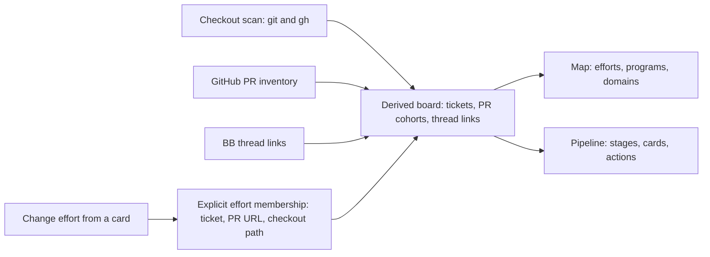
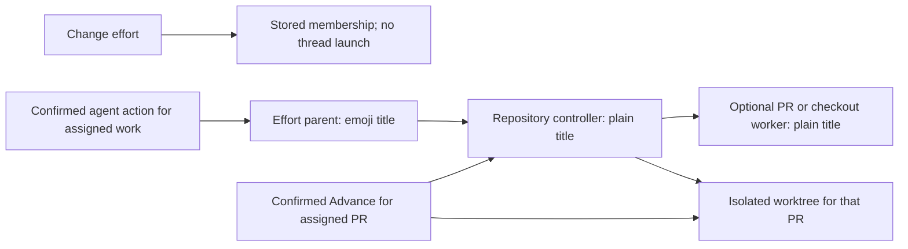

# Workstreams

Workstreams connects git checkouts that belong to the same ticket, even across
repositories. Its Map groups tickets into efforts, programs, and domains when
the evidence supports those levels. Its Pipeline places pull requests and
checkout work in six stages. The legacy Board groups checkouts by next action
or effort.

## Get started

From this directory:

```sh
npm install
bb plugin install .
bb plugin config workstreams
```

Set `scanRoots` to the directories that hold your checkouts. If you leave it
empty, Workstreams scans the paths of your BB projects. Open **Workstreams** in
the sidebar, or run `bb workstreams refresh` followed by `bb workstreams list`.

An authenticated `gh` supplies pull request state and enables Board actions.
Without it, the board shows observed local git activity, marks other checkouts
as unverified, and shows a warning. Workstreams looks
for ticket keys in branch names, Linear linkback comments, pull request titles
and descriptions, and checkout directory names, in that order. A ticket's
checkouts form one cluster. Related clusters can form an effort; levels that do
not add information collapse.

## Choose enrichment

The board works without model keys. Optional keys add detail:

| Setting | What it adds |
| --- | --- |
| `linearApiKeys` | Ticket titles, state, project, parent, and team names from each matching Linear workspace. The older `linearApiKey` setting still works. |
| `typesafeApiKey` | Jev selects ticket summaries and assigns related tickets to efforts and higher groups. |
| `anthropicApiKey` | With Jev enabled, Claude Sonnet 5 names groups and flags groups whose members look unrelated. It does not change membership. |

Set these under **Plugins → Workstreams** or with `bb plugin config workstreams
set <key> <value>`. Keys are optional. An Anthropic key alone does not enable
grouping.

The scanner stores board facts and caches in BB's local plugin storage. It uses
`git` locally and your authenticated `gh` to read GitHub pull requests and
perform Board actions that you confirm. A Linear key sends ticket identifiers
to Linear and retrieves issue details. With model keys, Jev receives ticket
keys, repository names, pull request titles, and available Linear context to
select summaries and groups. Bounded Jev reviews can revisit uncertain
singletons and mixed groups using shared outcome evidence; saved effort
membership stays fixed. Anthropic receives the member keys, summaries,
repository names, candidate phrases, and available Linear or thread-title
context needed to name a group. Automatic grouping calls happen when semantic
inputs change; an unchanged rescan reuses cached decisions. The optional **Fetch Linear details
via agent** action starts a BB thread only when you confirm it.

## Organize work from a thread

Use **Effort** above the thread composer to assign the thread to an effort,
even before it has a PR. Confirmed, unassigned work in the thread inherits
that effort, including existing recorded work and work discovered later.
Workstreams discovers PRs through the thread's exact checkout, recorded
actions, or explicit PR links. A PR mentioned only in a title or discussion
does not inherit automatically. Existing explicit assignments stay intact.
Clearing the thread effort leaves previously assigned work where it is.

If no effort fits, choose **Create effort**, enter a name, and select **Create
and assign**. **Suggest efforts** asks Jev to compare the thread title and
linked work with available efforts. Select a suggestion, then save your
choice. Jev can also select an editable name from the thread and work titles.
Suggestions do not change membership. Manual creation works without Jev.

Use **Move linked work** to change existing ticket or PR membership. The
picker shows the affected ticket, PRs, and checkouts. Select the work when a
thread has several links. Ticket work moves together; a standalone PR moves
on its own. **Link a PR** supplies an explicit link to a tracked pull request.

Explicit assignments use the same ticket and PR membership as the board.
Assigning work preserves existing thread parents and worker history and does
not create a coordinator or start an agent. You can set up a coordinator
separately. Turn off automatic dispatch for an affected effort before moving
its work. Automatic inheritance pauses while the destination effort has
automatic dispatch enabled.

## How work and agents connect

Workstreams combines scanned checkouts, GitHub pull request inventory, and
thread links into work context. Explicit effort membership for a ticket, pull
request, or checkout path takes precedence over inferred grouping. Map and
Pipeline read the resulting board without starting threads.



Changing a card's effort transfers the affected tickets, PRs, and checkout
paths after you review the scope. The change updates membership;
it does not launch an agent. When a checkout gains a PR, its explicit path
membership supplies the effort unless an explicit ticket or PR owner takes
precedence.



The confirmed agent action creates a missing parent or controller when it needs
one. A controller can work directly or delegate a bounded task to a child.
Advance keeps each PR's isolated worktree for inspection after the result
finishes. Workstreams retains merged PR worktrees; automatic cleanup is not
implemented.

## Use the views

- **Pipeline:** Track each open pull request once across **Build**, **Review**,
  **Feedback**, **Ready**, **Merged**, and **Released**. A draft stays in Build,
  even when its checks fail. Switch between stage columns and effort swimlanes;
  inventory-only PRs join their saved effort or ticket cohort, and unmatched
  PRs appear in **One-offs**. Cards show one blocker, agent activity, and a
  primary action. Each stage lists the most recently updated PRs first, with
  checkout-only work ordered by its latest commit. Merged and released cards
  use their merge date. Use **Open details** for merge gates, stack order,
  linked threads, checkout actions, and holds. Select a card by its title;
  the details button opens its drawer separately. Select the effort label or
  **Change effort…** in the card menu to review and move its work. Held PRs
  stay in their stage, show **On hold**,
  and offer **Release**; bulk actions and agent counts exclude them. Pipeline
  shows the five most recent merged cards and three most recent release-tagged
  cards until you choose **Show all**. Closed PRs that did not merge remain
  omitted by the current scan. A brief arrival cue marks changes to a card's
  stage, blocker, activity, or hold state. Unchanged refreshes stay still, and
  reduced-motion preferences disable the cue.
- **Pipeline actions:** Use a card to merge, advance, fix, nudge, or open a
  parent PR. Each card's **Next** line names its next move. Use card checkboxes
  or **Select visible**, then **Advance selected** to preview PRs across stages;
  search keeps earlier selections. **Advance** accepts open, unheld PRs,
  including drafts and PRs awaiting approval. The preview separates feedback,
  branch, and failed-check work from readiness checks, waiting PRs, and skips.
  **Review → Nudge** selects
  reviewers on PRs open for at least seven days. **Ready → Merge** processes
  unblocked PRs in order, with confirmation for each direct action. The agent
  sheet shows the plan, workspace, and whether work can push. Advance batch
  instructions come from the service and are fixed; single-row agent prompts
  and repair direction are editable. Progress appears on each card. Use
  **Advance history** in the Pipeline options menu for saved batch details.
- **Message agents:** On an open, unheld PR card, choose **Message agent** to
  send an instruction without leaving Pipeline. The details drawer lists linked
  effort coordinators, repository controllers, PR threads, and other threads,
  including links for PRs without a checkout. Workstreams selects the current
  repository controller when one is available. If several other threads qualify,
  choose the target. **Rebase and PTAL** fills an editable draft; only **Send
  message** delivers it. The composer reports whether BB sent or queued the
  message, and the board shows agent activity. The composer shows the selected
  agent's latest reply and live status. Use **Open thread** for the full
  conversation, or **Follow up** to send another message.
  Repository and effort threads can include work on other PRs.
- **Map:** Explore the grouping hierarchy. Switch between theme and risk faces,
  filter by status and code surface, and open a linked agent thread.
- **Approved filter:** Keep approved open PRs in view across Map, Pipeline,
  and the legacy Board; the selection persists across views and reloads. Map dims
  nonmatching work without changing its layout and counts checkout-backed PRs;
  Board also includes the PR inventory.
- **Legacy Board:** Open **Legacy Board** from Pipeline options. **Efforts**
  groups all tracked checkouts by effort. Open PRs
  without a scanned checkout join an effort when a saved PR link or an
  unambiguous ticket match connects them. Other PRs appear under **No effort
  assigned**. **PR backlog**
  groups your open PRs by next action in organizations represented by scanned
  projects, including PRs without a checkout. Approved
  is a review decision; **Ready to merge** also requires clear checks, review
  threads, branch state, and stack dependencies. Direct
  merge, branch update, and reviewer nudge actions ask for confirmation. CI,
  conflict, and review work shows the planned steps before you start a
  dedicated agent thread. You can expand and edit its instructions.
  Agent repairs inspect the PR and base, address actionable feedback, test,
  commit and push code changes, reply on the PR, and recheck live merge gates.
  A remote PR needs a scanned checkout for a single-PR agent repair; direct GitHub
  actions remain available without one. Merged and release-tagged work stays
  under its effort in collapsed sections.
  After the author pushes a newer head, resolves review threads, and posts a
  directed PTAL, the row reads **Awaiting re-review** while GitHub still reports
  changes requested. Workstreams does not send another PTAL or reviewer nudge.
- **Bulk advance:** In **Pipeline**, select open, unheld cards across stages and
  choose **Advance selected**. The legacy **PR backlog** offers the same action.
  Review the exact selection, planned feedback, branch, and failed-check work,
  and any waiting or skipped PRs before starting. For a
  PR in an effort, Workstreams routes each instruction through one persistent
  repository controller under the effort coordinator. The controller handles
  PRs in sequence and can delegate bounded PR work to child threads. Each PR
  keeps its own result and isolated worktree. If the effort has no coordinator,
  the confirmed action creates one
  before creating its repository controller. An unassigned PR uses a
  descriptively titled repository thread for the batch. The agent
  reads reviews and current code, verifies fixes already made, addresses
  remaining feedback, and integrates the base where needed. It tests changes,
  pushes with an exact commit lease when rewriting history, replies with
  evidence, and resolves only feedback verified as addressed. A pushed change
  receives a PR summary. A draft remains a draft. PRs that only need a
  readiness check run without an agent; pending review or checks remain waiting.
  Use **Fix…** on a result that needs attention to review its failure and fresh
  next steps, then choose a child of a linked thread or a new thread. An
  eligible stopped worker can continue when its ownership is clear. Repairs
  keep their own result history and do not extend the repository batch queue.
  **Threads** on each backlog row includes related author and action threads,
  including previous batch workers. These links remain when a readiness result
  becomes stale. Open a thread normally or beside the Board when BB supports
  split panes.
  The Board keeps per-PR results and checks current approval, feedback, checks,
  and stack dependencies before reporting **Ready to merge**. **Stop queued PRs**
  stops work that has not started; active workers can finish. Each progress row
  offers details, repair, threads, and readiness recheck. Removing a queued item
  cancels only that item; removing a finished item hides its progress record,
  which you can restore without requeueing it. Running items cannot be removed,
  and removal never deletes the PR, thread, or history. The batch never
  merges PRs. Worktrees remain available for inspection. One batch runs at a
  time, with up to two active repositories. Saved batches keep their original
  scope; start a new preview to authorize feedback work on an earlier result.
  If a parent update makes a verification-only child need edits, preview that
  child again to authorize the added work. Fork writes and mixed BB project
  mappings within one repository need separate handling; the batch reports
  these skips.
- **Effort threads:** Choose **🧭 Coordinate** on an effort to review its linked
  tickets and PRs, set its name and goal, and choose a matching BB project.
  Create a planning thread in a separate worktree with that project's default
  agent, or link an eligible idle thread. New and explicitly linked coordinator
  titles use a relevant emoji or a stable, varied fallback, preserving an
  existing leading emoji. Repository controllers and PR or checkout workers use
  plain titles. Creating a coordinator establishes a stable effort identity
  that later grouping passes preserve. **Effort thread** opens it from the
  heading. Authorized PR work uses a repository controller as its parent or
  destination. Repair previews retain earlier PR workers and result links for
  context. Assigning work or opening an effort does not launch a controller.
  Linking a coordinator does not move existing PR threads or replace PR result
  cards. Generic team containers and Unsorted are not coordinator scopes.
- **Automatic agent actions:** Choose an effort, then use **Off**,
  **Preview only**, or **Run automatically**. Preview only shows the next
  candidate on its pull request row without starting an agent. Run
  automatically starts at most one agent at a time for failing CI, merge
  conflicts, requested changes, or unresolved inline comments.
  The agent works locally and is instructed to ask before pushing or replying
  on GitHub. Workstreams checks the PR again before it calls a transition
  verified. An unresolved gate pauses further dispatch until a fresh scan
  confirms it cleared. **Off** stops new dispatches; it does not cancel an
  agent already running. The latest finished Board action appears in the
  workstream's outcome card, which flags newer activity in its linked thread.
  Run automatically never merges or deploys.
- **Archived threads:** Archive an idle leaf thread from its thread menu.
  Use **Archived threads** to review history or undo an archive. Workstreams
  will not archive a thread with children.
- **How this works:** Open the ⓘ panel for state definitions, shortcuts, scan
  health, and warnings.

`bb workstreams list [--json]` reads the last scan. Workstreams also refreshes
on relevant git ref changes and idle thread transitions, plus its configured
interval; use `bb workstreams refresh` when freshness matters. It does not
subscribe to GitHub webhooks. `bb workstreams group <TICKET> <effort name>` sets a
manual effort name; `bb workstreams ungroup <TICKET>` removes it.

The **In release tag** label means a merged commit appears in a local release
tag. It does not verify deployment. When a repository has no usable release
tags, merged work remains `merged` and the board warns.
Closed pull requests that did not merge are omitted from the Map and Board,
even when their checkouts are dirty or ahead of upstream. Merged work remains
visible.

**Approved · review note** means the approving review contains written feedback
that may need action; it is distinct from unresolved inline threads. When the
feedback's threads are resolved and a later fix is pushed, the row leads with
the current **Approved · ready** state.

Automatic dispatch starts from existing PRs with a scanned checkout. It does
not create PRs from issues or checkouts, request review, or merge; those steps
remain Board actions. Its workflow ends when GitHub reports the PR merged.

PR row menus include **Put on hold** with an optional reason; held PRs keep their GitHub readiness and thread access, appear under **Held** in their effort and PR backlog, and are excluded from Advance and automatic actions. **Release hold** returns a PR to its current readiness group without changing GitHub.

## Develop

The scanner and Anthropic naming call live in `host.ts`. `server.ts` handles
settings, local storage, refresh, enrichment, actions, and the CLI. The grouping
and lifecycle rules live in `workstreams.ts`; `app.tsx` mounts Map, Pipeline,
and the legacy Board. `pipeline.ts` derives Pipeline stages and actions from
scanned facts.
`contract.ts` defines the host RPC schema, and `skills/workstreams/SKILL.md`
documents the CLI for agents.

```sh
npm test
npm run typecheck
npm run build
```

After editing the plugin, run `bb plugin reload workstreams`. The build creates
the distributable files in `dist/` for git or npm installs.
